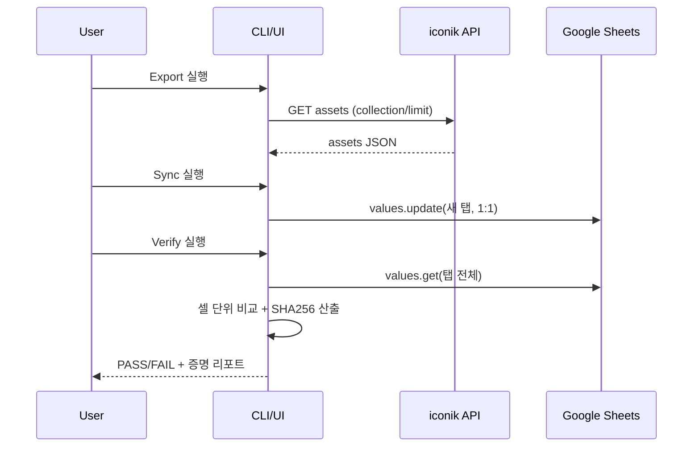

# PRD-0010 UI 목업 (Mermaid)

이 프로젝트는 현재 CLI 스크립트 중심이지만, 운영/검수 흐름을 표준화하기 위해 “동기화·검증·증명 리포트”를 한 화면에서 다루는 간단한 UI(예: Streamlit/내부 웹) 구성을 가정합니다.

## 화면/기능 맵
```mermaid
flowchart TB
  Start([시작]) --> Config[설정]
  Config -->|Sheet ID/탭| SheetSel[시트 선택/새 탭 생성]
  Config -->|iconik/env| IconikCfg[iconik 설정(.env)]
  Config -->|Google Auth| GoogleCfg[서비스계정/OAuth]

  SheetSel --> Actions[작업 선택]
  IconikCfg --> Actions
  GoogleCfg --> Actions

  Actions --> Export[Export: iconik API → JSON]
  Actions --> Sync[Sync: JSON → Sheet(1:1)]
  Actions --> Verify[Verify: Sheet ↔ JSON(증명)]
  Actions --> Roundtrip[Roundtrip: Sheet → iconik\n(dry-run 기본)]

  Export --> Results[결과/리포트]
  Sync --> Results
  Verify --> Results
  Roundtrip --> Results
```

## Verify 화면 레이아웃(목업)
```mermaid
flowchart LR
  subgraph Controls[상단 컨트롤]
    A[Sheet ID] --> B[Tab]
    C[기준 JSON 경로] --> D[모드(base/all/common)]
    E[매칭(order/id)] --> F[Verify 실행]
  end
  subgraph Summary[요약]
    S1[PASS/FAIL]
    S2[행/컬럼 수]
    S3[불일치 셀 수]
  end
  subgraph Proof[증명(해시)]
    P1[SHA256(expected)]
    P2[SHA256(actual)]
  end
  subgraph Details[상세]
    D1[불일치 예시 TOP N]
    D2[행 ↔ asset(id/title) 전체 매칭 출력]
  end

  Controls --> Summary --> Proof --> Details
```

## 데이터 플로우(검증/증명)


