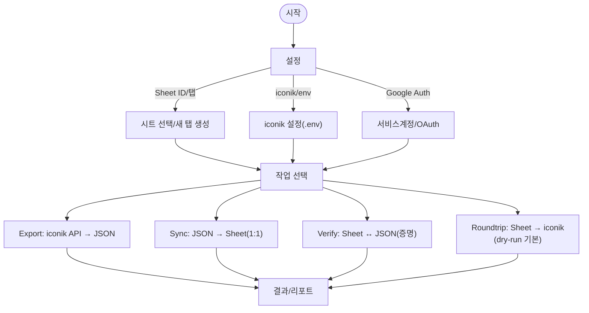
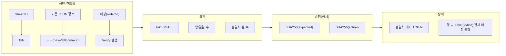
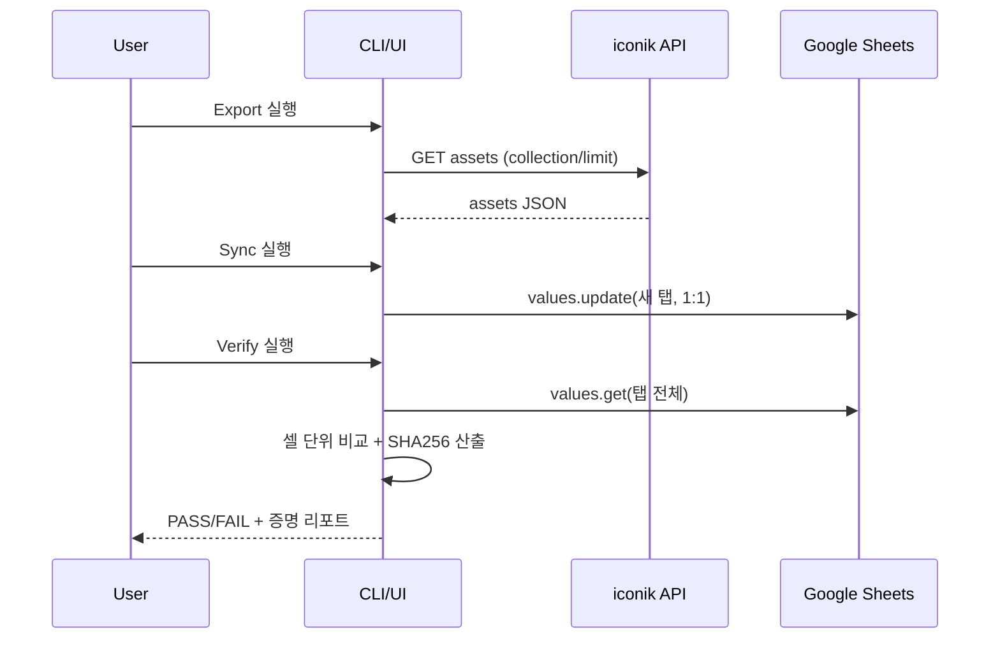
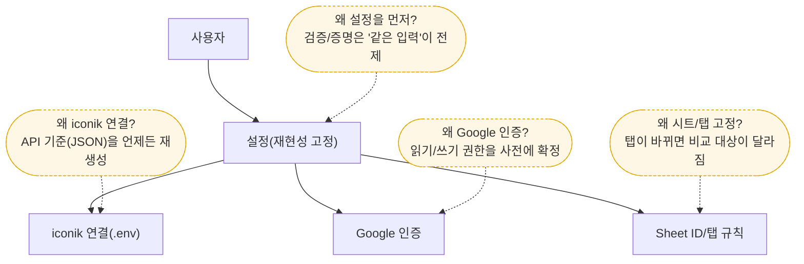
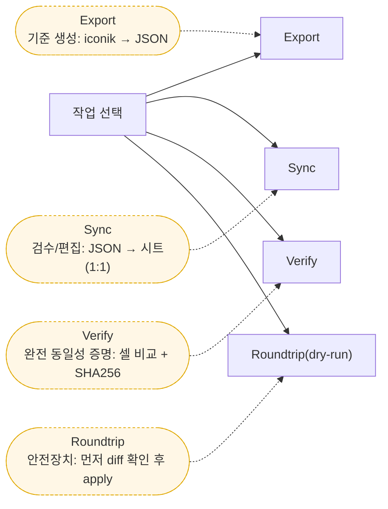
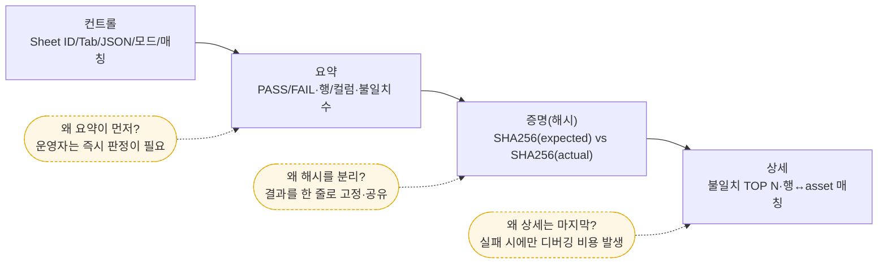
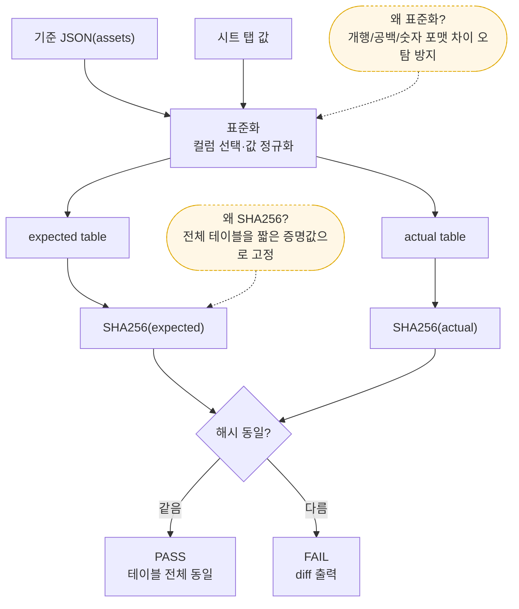

# PRD-0010 UI 목업 (Mermaid)

이 프로젝트는 현재 CLI 스크립트 중심이지만, 운영/검수 흐름을 표준화하기 위해 “동기화·검증·증명 리포트”를 한 화면에서 다루는 간단한 UI(예: Streamlit/내부 웹) 구성을 가정합니다.

> 참고: Mermaid “다이어그램 프리뷰”는 코드 블록만 렌더링하는 경우가 있어 본문 설명이 안 보일 수 있습니다. 이 파일 전체 텍스트를 보려면 Markdown 프리뷰를 사용하세요.

## 화면/기능 맵

## Verify 화면 레이아웃(목업)

## 데이터 플로우(검증/증명)

## 설계 의도(다이어그램)

### 1) 왜 “설정”을 먼저 고정하는가

### 2) 왜 작업을 Export/Sync/Verify/Roundtrip 4개로 나누는가

### 3) 왜 Verify 결과를 “요약 → 증명(해시) → 상세” 순서로 보여주는가

### 4) “완벽 매칭 증명(SHA256)”은 어떤 논리로 성립하는가

