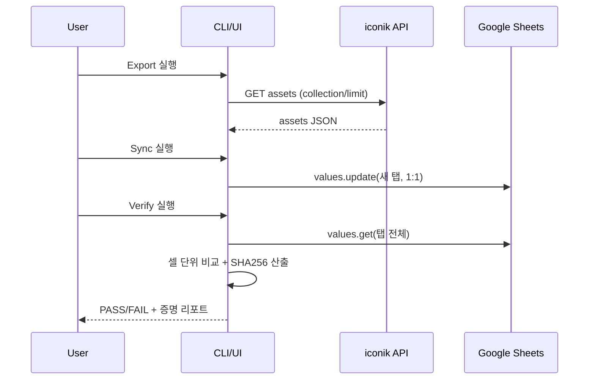

# PRD-0010 UI 목업 (Mermaid)

이 프로젝트는 현재 CLI 스크립트 중심이지만, 운영/검수 흐름을 표준화하기 위해 “동기화·검증·증명 리포트”를 한 화면에서 다루는 간단한 UI(예: Streamlit/내부 웹) 구성을 가정합니다.

## 화면/기능 맵
```mermaid
flowchart TB
  Start([시작]) --> Config[설정]
  Config -->|Sheet ID/탭| SheetSel[시트 선택/새 탭 생성]
  Config -->|iconik/env| IconikCfg[iconik 설정(.env)]
  Config -->|Google Auth| GoogleCfg[서비스계정/OAuth]

  SheetSel --> Actions[작업 선택]
  IconikCfg --> Actions
  GoogleCfg --> Actions

  Actions --> Export[Export: iconik API → JSON]
  Actions --> Sync[Sync: JSON → Sheet(1:1)]
  Actions --> Verify[Verify: Sheet ↔ JSON(증명)]
  Actions --> Roundtrip[Roundtrip: Sheet → iconik\n(dry-run 기본)]

  Export --> Results[결과/리포트]
  Sync --> Results
  Verify --> Results
  Roundtrip --> Results
```

## Verify 화면 레이아웃(목업)
```mermaid
flowchart LR
  subgraph Controls[상단 컨트롤]
    A[Sheet ID] --> B[Tab]
    C[기준 JSON 경로] --> D[모드(base/all/common)]
    E[매칭(order/id)] --> F[Verify 실행]
  end
  subgraph Summary[요약]
    S1[PASS/FAIL]
    S2[행/컬럼 수]
    S3[불일치 셀 수]
  end
  subgraph Proof[증명(해시)]
    P1[SHA256(expected)]
    P2[SHA256(actual)]
  end
  subgraph Details[상세]
    D1[불일치 예시 TOP N]
    D2[행 ↔ asset(id/title) 전체 매칭 출력]
  end

  Controls --> Summary --> Proof --> Details
```

## 데이터 플로우(검증/증명)


## 목업 설명(의도/동작)

### 1) 화면/기능 맵 해설
- **설정** 단계에서 “데이터 소스 2개”를 고정합니다: iconik(API/`.env`)과 Google Sheets(스프레드시트 ID/인증).
- **작업 선택**은 운영자가 실제로 하는 4가지 행동을 그대로 버튼화한 것입니다.
  - Export: iconik API에서 기준 JSON을 생성(예: `export_assets.py`)
  - Sync: 기준 JSON을 시트 “새 탭”에 1:1(에셋 1개=행 1개)로 작성(예: `sync_to_sheet.py`)
  - Verify: 시트 값이 기준 JSON과 **완전히 동일함**을 증명(예: `verify_sheet_matches.py`)
  - Roundtrip: (차기) 시트 변경을 iconik에 반영하되 `dry-run`을 기본값으로 둠

### 2) Verify 화면 해설
- 상단 컨트롤은 검증을 “재현 가능”하게 만드는 최소 입력만 둡니다.
  - `모드(base/all/common)`: 비교 컬럼 범위를 고정(기본 35컬럼만/확장 포함 전체/공통 컬럼)
  - `매칭(order/id)`: 행을 “순서 기반” 또는 “id 기반”으로 대응(품질/안전 요구에 따라 선택)
- 결과 영역은 확인 순서(요약→증명→상세)에 맞춰 배치합니다.
  - **요약**: PASS/FAIL, 행/컬럼 수, 불일치 셀 수로 1차 판정
  - **증명(해시)**: `SHA256(expected)`와 `SHA256(actual)`이 동일하면 “표준화된 테이블 전체가 동일”함을 고정된 값으로 제시
  - **상세**: 실패 시 원인 파악을 위해 불일치 TOP N + 행↔asset 매칭 목록을 제공

### 3) 데이터 플로우 해설
- Export/Sync/Verify를 분리해 “검수용 시트”가 언제/어떻게 만들어졌는지 추적 가능하게 합니다.
- Verify는 **셀 단위 비교**로 결론을 내리고, 동시에 해시를 남겨 “동일성 주장”을 반복 검증할 수 있게 합니다.
